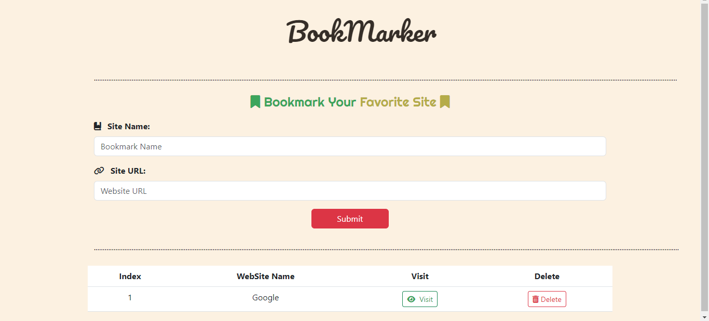

# Bookmarker App

This is a simple Bookmarker application that allows you to add and manage your favorite websites. It uses HTML, CSS, and JavaScript.

## Features

- Add and delete bookmarks
- Validate website URLs using Regular Expressions (Regex)
- Bootstrap validation for input fields
- User-friendly interface
- Responsive design for all devices

## Technologies Used

- HTML
- CSS (Bootstrap for responsive design and form validation)
- JavaScript

## Preview

## Live Demo

Check out the live demo [here](https://mohammed-fawzzi.github.io/Book-Marker/).
